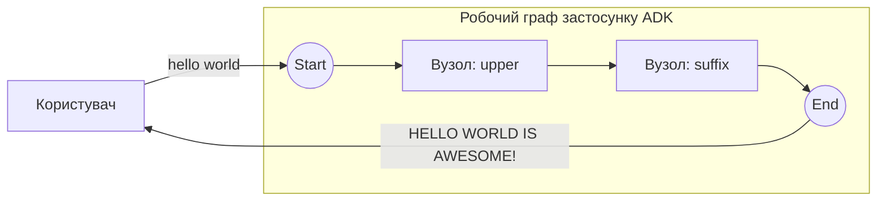

# Базовий послідовний граф

Найменший можливий граф: два `FunctionNode`, з'єднані в прямий ланцюжок через `workflow.Chain`. Перший вузол переводить повідомлення користувача у верхній регістр, другий додає суфікс. Без LLM, без маршрутизації, без HITL — лише послідовний «щасливий шлях».

- **Ідея:** З'єднати вузли по порядку через `workflow.Chain(Start, nodeA, nodeB)`.
- **Потрібна LLM?** Ні

## Мета

Показати абсолютний мінімум, потрібний, щоб підняти агента-граф: визначити звичайні функції Go, обгорнути кожну як `FunctionNode`, з'єднати їх через `Chain` і передати результат лаунчеру. Виведення кожного вузла стає входом наступного вузла.

## Граф



1. **upper**: `FunctionNode`, який отримує повідомлення користувача й повертає `strings.ToUpper(input)`.
2. **suffix**: `FunctionNode`, який додає `" IS AWESOME!"` до свого входу.

Лише виведення кінцевого вузла показується користувачеві; проміжний `HELLO WORLD` передається далі як вхід `suffix`, але не друкується окремо. Обидва вузли використовують `workflow.DefaultRetryConfig()`, тож тимчасовий збій повторюється з експоненційною затримкою.

## Запуск

```bash
go run . console
```

## Приклад сесії

```text
User -> hello world
Agent -> HELLO WORLD IS AWESOME!
```
