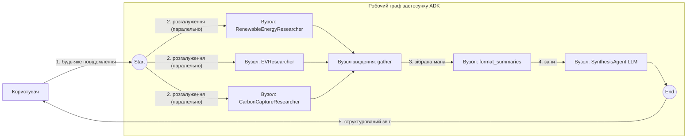

# Складний граф — паралельне дослідження → зведення → синтез

Нетривіальний граф, який розгалужується на трьох дослідників, збирає їхні результати на бар'єрі й об'єднує їх фінальним агентом. Це граф-нативна версія прикладу adk-python «parallel web research» і вітрина розгалуження (fan-out) / зведення (fan-in) рушія графових робочих процесів.

- **Ідея:** Розгалуження (fan-out) до паралельних агентів, зведення (fan-in) на `JoinNode`, потім синтез (`AddFanOut` + `AddFanIn` + `NewJoinNode`).
- **Потрібна LLM?** Так (Gemini з grounding (Google Search))

## Мета

Продемонструвати паралельні примітиви рушія наскрізно: три агенти-дослідники виконуються паралельно над незалежними темами, бар'єр зведення чекає на всіх них, вузол-функція переформовує зібрані результати в один запит, а одноходовий агент синтезу об'єднує все в один структурований звіт.

## Провайдер і ключі

Приклад визначає свого провайдера так само, як лабораторні Дня 3, через `internal/modelcfg`: `apps/.env` надає ключі, а `MODEL` / `DEFAULT_MODEL_PROVIDER` вибирають провайдера й модель. Задайте їх у `apps/.env` (шаблон: `apps/.env-example`) або експортуйте в оболонці.

Цьому прикладу потрібен провайдер **Gemini**, бо дослідники викликають Gemini з grounding (Google Search) — провайдер має бути `gemini` або `agentgateway/gemini` (grounding підтримується лише на моделях Gemini). Зі `DEFAULT_MODEL_PROVIDER=gemini` покладіть ключ у `apps/.env`:

```bash
# apps/.env
DEFAULT_MODEL_PROVIDER=gemini
GOOGLE_API_KEY=...
```

Більше нічого не потрібно хардкодити: `modelcfg` вибирає назву моделі.

## Граф



`Start` розгалужується на трьох дослідників, які виконуються паралельно; вузол зведення `gather` — це бар'єр, який чекає на всіх трьох і передає своєму наступнику `map[nodeName]output`; `format_summaries` перетворює цю мапу на один запит; а `SynthesisAgent` об'єднує все у фінальний звіт.

## Запуск

```bash
go run . console
```

Надішліть будь-яке повідомлення, щоб почати запуск — теми дослідження фіксовані, тож повідомлення лише запускає конвеєр.

Кожен вузол породжує події, тож консоль друкує **спершу всі три підсумки дослідників, а потім синтезований звіт**. Підсумки з'являються в недетермінованому порядку (дослідники працюють паралельно), а в інтерактивному терміналі типове потокове виведення токенів перемішує їх. Для чистого виведення блоками вимкніть потокове виведення:

```bash
go run . console -streaming_mode none
```

## Приклад сесії

```text
Agent -> Driven by falling costs, solar PV is projected to overtake ...   (RenewableEnergyResearcher)
Agent -> The latest electric vehicle advancements focus on ...            (EVResearcher)
Agent -> Recent advancements in carbon capture feature ...                (CarbonCaptureResearcher)
Agent -> ## Recent Sustainable Technology Advancements                    (SynthesisAgent)

         ### Renewable Energy
         ...

         ### Electric Vehicles
         ...

         ### Carbon Capture
         ...

         ### Overall Conclusion
         ...
```

## Що показує

| Ідея | Де |
|---|---|
| Розгалуження (fan-out) — незалежні вузли виконуються паралельно | `eb.AddFanOut(workflow.Start, renewableNode, evNode, carbonNode)` |
| Зведення (fan-in) — бар'єр, що чекає на кожного попередника | `workflow.NewJoinNode("gather")` + `eb.AddFanIn(...)` |
| Споживання `map[nodeName]output` з вузла зведення | `formatSummaries` читає зібрану мапу за іменем вузла |
| `FunctionNode`, що трансформує дані всередині графа | `format_summaries` перетворює мапу на один запит |
| Одноходовий `AgentNode` після попередника (не `Start`) | вузол `SynthesisAgent` споживає результат форматувальника |
| Повторні спроби з наростаючою паузою для кожного вузла | `llmNodeConfig.RetryConfig` на LLM-вузлах |
| Вбудований grounding (Google Search) | `geminitool.GoogleSearch{}` на кожному досліднику |
| Типова сесія в пам'яті | `launcher.Config` задає лише `AgentLoader` |

## Нотатки

`JoinNode` — єдиний вузол, який може мати кілька **безумовних** вхідних ребер; зведення звичайних вузлів у такий спосіб відхиляється (`ErrUnsupportedFanIn`). `LlmAgent`, який не оголошує жодного режиму, виконується одноходово у вузлі графа, і саме це дозволяє агенту синтезу стояти всередині графа: агент у режимі чату можна приєднати лише безпосередньо від `Start`. Режим визначається для кожного розміщення, тож власне оголошення агента залишається незмінним, і той самий екземпляр можна розмістити деінде.

Ця поведінка розгалуження/зведення збігається з графовим робочим процесом adk-python, який породжує ті самі події для кожного дослідника перед синтезом.
