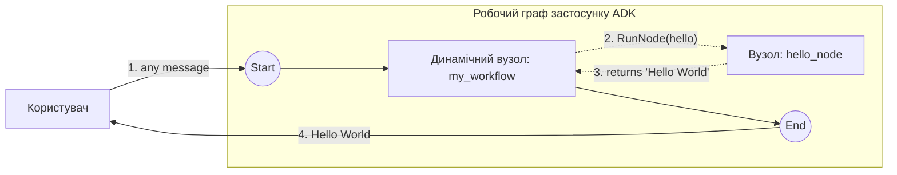

# Динамічний граф (базовий)

Мінімальний **динамічний** граф: батьківський динамічний вузол виражає порядок виконання звичайним кодом Go і викликає один дочірній вузол через `workflow.RunNode`. Повторює фрагмент «Get started» з <https://adk.dev/graphs/dynamic/>.

- **Ідея:** Імперативна оркестрація дочірніх вузлів за допомогою `workflow.NewDynamicNode` + `workflow.RunNode` замість оголошення статичних ребер.
- **Потрібна LLM?** Ні

## Мета

Статичні графи (див. [`../../basic`](../../basic)) оголошують кожне ребро заздалегідь. **Динамічний вузол** натомість виконує функцію Go як своє тіло й вирішує під час виконання, які дочірні вузли викликати і в якому порядку — корисно для циклів, розгалуження та залежного від даних потоку керування. Цей приклад — найменша версія: оркестратор викликає один дочірній вузол і повертає його результат.

## Граф



Суцільні стрілки — це ребра статичного графу; пунктирні стрілки — імперативні виклики `RunNode`, зроблені з тіла динамічного вузла. `hello_node` ігнорує свій вхід і повертає константу `"Hello World"`. Динамічні вузли типово мають `RerunOnResume = &true`, що потрібно для моделі повторного входу/продовження (див. [`../hitl`](../hitl)).

## Запуск

```bash
go run . console
```

## Приклад сесії

Оркестратор ігнорує текст повідомлення, тому будь-який вхід дає однаковий запуск.

```text
User -> hi
Agent -> Hello World
```
