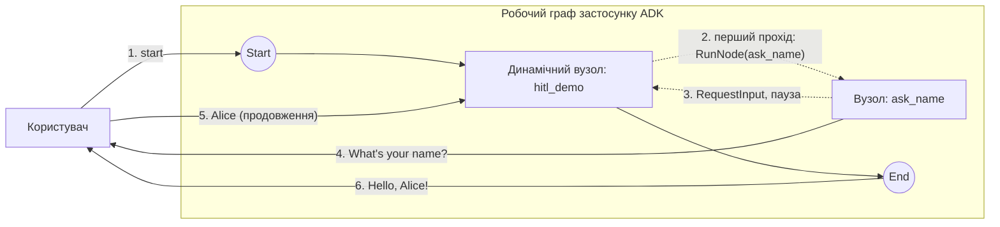

# Динамічний граф + HITL

Динамічний оркестратор, який **ставить на паузу для введення від людини** через `workflow.RunNode`, а потім продовжує виконання й вітає користувача. Демонструє патерн продовження з повторним входом у динамічному вузлі.

- **Ідея:** Поставити динамічний вузол на паузу для введення, а потім продовжити, повторно запустивши його тіло й прочитавши відповідь із `agent.Context.ResumedInput`.
- **Потрібна LLM?** Ні

Варіант того самого сценарію як статичного ланцюжка див. у [`../../hitl_simple`](../../hitl_simple).

## Мета

Показати, як працює HITL (людина в циклі) всередині *динамічного* вузла. Динамічні вузли типово мають `RerunOnResume = &true`: після відповіді людини тіло оркестратора викликається **заново згори**, а відповідь надходить через `ResumedInput(interruptID)`. Тіло спершу перевіряє наявність цієї відповіді; якщо її ще немає, воно викликає вузол `ask_name`, який видає `RequestInput` і перериває виконання.

## Граф



- **Перший прохід:** `hitl_demo` не знаходить відновленого введення, тож запускає `ask_name`, який видає подію `RequestInput` (прив'язану до `InterruptID`, виведеного з виклику) і повертає `ErrNodeInterrupted` — виконання стає на паузу.
- **Продовження:** консоль передає відповідь людини; `hitl_demo` запускається заново згори, знаходить відповідь під тим самим `InterruptID` через `ResumedInput`, видає привітання як контент і повертається.

## Запуск

```bash
go run . console
```

## Приклад сесії

```text
User -> start
Agent -> What's your name?
User -> Alice
Agent -> Hello, Alice!
```
