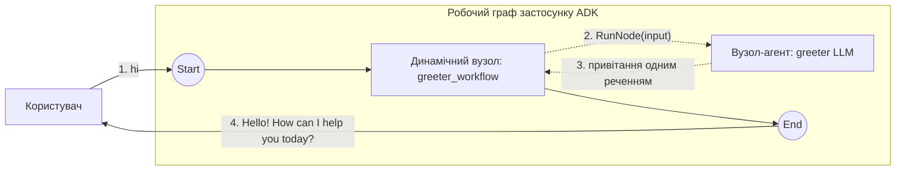

# Динамічний граф + LLM

Динамічний оркестратор, який викликає єдиний вузол на базі `LlmAgent` через `workflow.RunNode`. Найменша корисна композиція `NewDynamicNode`, `NewAgentNode` і `RunNode`.

- **Ідея:** Викликати `LlmAgent` зсередини тіла Go динамічного вузла, обгорнувши його як `AgentNode` і викликавши через `RunNode`.
- **Потрібна LLM?** Так (Gemini)

## Мета

Поєднати два будівельні блоки: `LlmAgent` (модель) і динамічний вузол (імперативний потік керування). Агента обгорнуто через `workflow.NewAgentNode`, тож ним можна керувати з коду, а далі динамічний оркестратор викликає його один раз і повертає його відповідь. Та сама форма масштабується до багатокрокових конвеєрів, розгалуження та циклів — просто додайте більше викликів `RunNode` у тіло.

## Провайдер і ключі

Провайдера обирають `MODEL` / `DEFAULT_MODEL_PROVIDER`, як у лабораторних дня 3. Покладіть ключі в `apps/.env` (див. шаблон `apps/.env-example`) або експортуйте ті самі змінні, і `internal/modelcfg` обере провайдера та модель:

```bash
# Вибір провайдера й моделі
export DEFAULT_MODEL_PROVIDER=...   # напр. gemini, openai, ollama
export MODEL=...                    # напр. gemini-flash-latest

# Облікові дані для обраного провайдера (шаблон містить усі)
export GOOGLE_API_KEY=...
```

## Граф



Суцільні стрілки — це статичні ребра графу; пунктирні стрілки — імперативний виклик `RunNode` до обгорнутого `LlmAgent`. Єдина інструкція агента `greeter` — привітати користувача рівно одним коротким реченням.

## Запуск

```bash
go run . console
```

## Приклад сесії

Точне формулювання походить від моделі, тож воно змінюється між запусками.

```text
User -> hi
Agent -> Hello there! How can I help you today?
```
