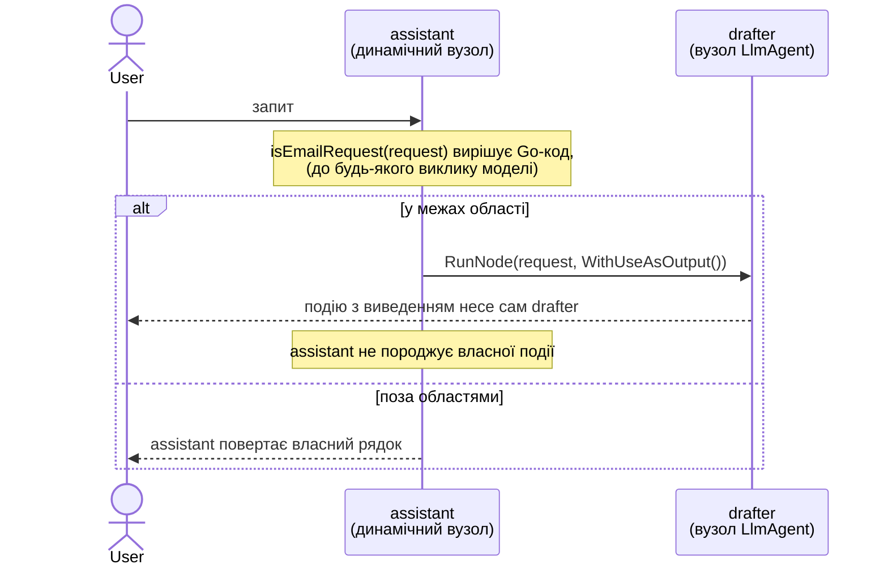

# Динамічний граф + делегування виведення

Динамічний оркестратор, який передає своє фінальне виведення дочірньому вузлові
замість того, щоб породжувати його сам. Запит у межах області делегується
дочірньому `LlmAgent` за допомогою `workflow.WithUseAsOutput()`, тож власна подія
агента *і є* виведенням оркестратора. Запит поза областями оркестратор обробляє
сам, звичайним `return`.

- **Ідея:** Зробити виведення дочірнього вузла фінальним виведенням
  батьківського динамічного вузла за допомогою
  `workflow.RunNode(..., workflow.WithUseAsOutput())`.
- **Потрібна LLM?** Так (Gemini). Лише гілка, що делегує, викликає модель, але
  облікові дані потрібні, щоб запустити будь-яку з них.

## Мета

За замовчуванням виведенням динамічного вузла є те, що повертає його тіло Go, тож
делегувати дочірньому вузлові означає захопити значення дочірнього вузла й
повернути його знову. Це працює, але породжує той самий вміст двічі: один раз на
події дочірнього вузла і один раз на фінальній події оркестратора.

`WithUseAsOutput()` прибирає другу. Подію дочірнього вузла позначено як виведення
батьківського вузла, і батьківський вузол не породжує власної фінальної події, тож
відповідь дочірнього `LlmAgent` несеться рівно однією подією, автор якої — сам
агент, а не граф. Консоль у будь-якому разі друкує відповідь один раз, тож
економія проявляється в потоці подій, а не у виводі в консолі нижче.

Приклад вміщує обидві гілки в один вузол, щоб будь-яку з них можна було задіяти з
консолі: введіть запит зі згадкою про email, щоб піти гілкою делегування, або
будь-що інше, щоб піти гілкою звичайного `return`.

## Провайдер і ключі

Налаштуйте провайдера так само, як на лабораторних дня 3: покладіть ключі в
`apps/.env` (скопіюйте `apps/.env-example`) або експортуйте ті самі змінні, і
`internal/modelcfg` обере провайдера та модель. `DEFAULT_MODEL_PROVIDER` задає
провайдера явно; залиште його порожнім — і провайдера буде визначено автоматично
за наявними обліковими даними (agentgateway → ollama → gemini → openai). `MODEL`
перевизначає модель. Ніколи не комітьте справжні облікові дані.

```bash
# Або заповніть apps/.env:
cp apps/.env-example apps/.env

# Або експортуйте ті самі змінні, наприклад для Gemini:
export GOOGLE_API_KEY=...
export DEFAULT_MODEL_PROVIDER=gemini
```

Модель будується під час запуску, до виконання перевірки, тож без налаштованого
провайдера приклад завершується гучно, а не показує запрошення: `modelcfg.Load`
падає з повідомленням, яке називає змінну для встановлення (українською, напр.
`жодного провайдера не налаштовано ... Впишіть ключ у apps/.env (шаблон —
apps/.env-example) ...`). Це стосується і гілки поза областями, хоча вона й не
викликає модель.

## Граф



Стрілка назад до користувача — це і є вся суть: на гілці делегування вона виходить
від `drafter`, а не від `assistant`. `assistant` також є останнім вузлом графа —
`Start → assistant` — його єдине статичне ребро, а все інше вище відбувається
всередині тіла Go оркестратора.

## Запуск

```bash
go run . console
```

## Приклад сесії

Формулювання листа походить від моделі, тож воно змінюється між запусками. А яка
гілка виконується — ні: це вирішує Go-код.

```text
User -> what is the weather today
Agent -> Out of scope. Ask me to draft an email.

User -> email the team that Friday standup is canceled
Agent -> Subject: Friday Standup Canceled
Hi Team,
Please note that our standup meeting this Friday is canceled.
If you have any urgent updates or blockers to share, please post them in our team channel. Otherwise, we will resume our regular schedule next week.
Have a great weekend!
Best regards,
[Your Name]
```

## Що показує

| Ідея | Де |
|---|---|
| `workflow.WithUseAsOutput()` | передається в `RunNode` на гілці в межах області, роблячи виведення drafter фінальним виведенням `assistant`, несеним на власній події drafter |
| Делегування пригнічує фінальну подію батьківського вузла | відповідь drafter породжується один раз, її автор — `drafter`, і `assistant` не породжує власної події |
| Звичайний return як виведення | гілка поза областями повертає рядок з тіла, який стає фінальним виведенням `assistant` |
| Реєстрація обгорнутого агента | `SubAgents: []agent.Agent{drafterAgent}` дає рушію змогу визначити `drafter` як автора події |

## Нотатки

### Вузол, що делегує, — останній у цьому графі

Делеговане значення подорожує на події дочірнього вузла й не записується як власне
виведення батьківського вузла, тож вузол, приєднаний після динамічного вузла, що
делегує, отримує нульове значення, а не делегований текст — мовчки, без помилки.
Саме тому `assistant` не має наступника. Приєднання після звичайного `RunNode`
поводиться нормально, бо там батьківський вузол породжує власну фінальну подію.

### Чому гілку обирає звичайний Go-код

Перевірка — це пошук підрядка в запиті користувача, а не виклик моделі чи перевірка
довжини згенерованого тексту. Це зберігає обидві гілки доступними на вимогу, тож
наведений вище запуск відтворюється. Перевірка, що залежить від виведення моделі,
робила б вибір гілки різним від запуску до запуску, а це хибна властивість для
прикладу, вся суть якого — різниця між двома гілками.

### Одне делегування на активацію

`WithUseAsOutput()` можна використати щонайбільше на одному дочірньому вузлі на одну
активацію батьківського. Другий виклик `RunNode`, що делегує, у тому самому тілі
завершується помилкою `workflow.ErrOutputAlreadyDelegated`. Делегування також
утворює ланцюжок: якщо делегований дочірній вузол сам є динамічним вузлом, що
делегує, подію найглибшого дочірнього вузла позначено для всього ланцюжка предків.

### Як змінити модель

Встановіть `MODEL` (в `apps/.env` або в середовищі) у будь-яку модель, до якої мають
доступ ваші облікові дані. Промпт drafter короткий, тож із ним упорається будь-яка
сучасна модель.
