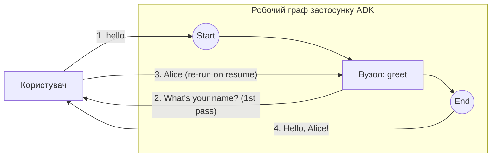

# HITL (людина в циклі) — повторний вхід в один вузол

Робочий процес HITL (людина в циклі), у якому **один** емітний `FunctionNode` і робить паузу для введення, і видає фінальний результат. Після продовження вузол запускається заново згори (`NodeConfig.RerunOnResume = &true`).

- **Ідея:** HITL з повторним входом в один вузол за допомогою `workflow.ResumeOrRequestInput`.
- **Потрібна LLM?** Ні

Двовузловий варіант із передаванням див. у [`../hitl_simple`](../hitl_simple).

## Мета

Порівняти два способи зробити HITL. У двовузловому варіанті з *передаванням* ([`../hitl_simple`](../hitl_simple)) один вузол запитує, а окремий вузол споживає відповідь. Цей приклад зводить обидві фази в один вузол із повторним запуском:

- `workflow.ResumeOrRequestInput` емітить `RequestInput` і на **першому** проході повертає `ErrNodeInterrupted` (пауза, без виведення);
- після відповіді людини вузол **запускається заново згори**, і той самий виклик тепер повертає відповідь, яку тіло вузла перетворює на фінальне виведення.

## Граф



Пронумеровані ребра — це обмін між користувачем і застосунком, по порядку. Оскільки `RerunOnResume = &true`, відповідь на кроці 3 знову входить у `greet` (а не тече далі до наступника, як було б у [`../hitl_simple`](../hitl_simple)), тож один і той самий вузол виконується двічі: спершу він запитує й робить паузу (крок 2), а потім під час продовження запускається заново згори й видає вітання (крок 4). `InterruptID` містить ID виклику, тож відповідь усе ще зіставляється крізь повторний запуск у межах одного запуску, проте пізніший запуск знову видає запрошення до введення.

## Запуск

```bash
go run . console
```

## Приклад сесії

```text
User -> hello
Agent -> What's your name?
User -> Alice
Agent -> Hello, Alice!
```
