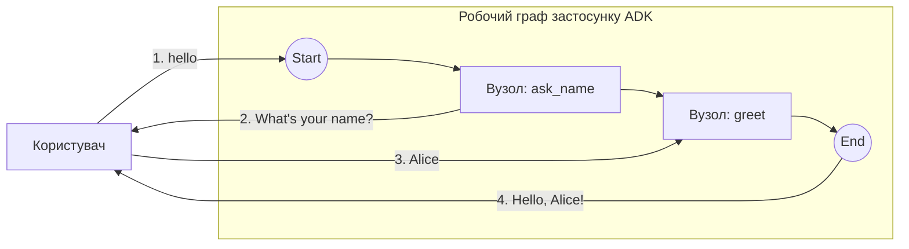

# HITL (людина в циклі) — мінімум, два вузли

Мінімальний наскрізний HITL-граф: два вузли, де перший стає на паузу для введення, а другий споживає відповідь людини. Без LLM, без ключа API, без потокового виведення (жоден провайдер не потрібен) — найменше, що задіює підтримку паузи/продовження в консольному лаунчері.

- **Ідея:** Двовузлове передавання HITL — пауза з `RequestInput`, продовження в наступний вузол.
- **Потрібна LLM?** Ні

Споріднений варіант: [`../hitl_rerun`](../hitl_rerun) — той самий сценарій як єдиний вузол повторного входу.

## Мета

Продемонструвати найпростіший можливий патерн HITL (людина в циклі). `ask_name` породжує подію `RequestInput` і повертає `ErrNodeInterrupted`, що ставить граф на паузу; консольний лаунчер відображає запрошення до введення; відповідь користувача доставляється до `greet` як його типізований вхід.

## Граф



1. **ask_name**: `FunctionNode`, що породжує події: він видає `RequestInput` (з новим `InterruptID` для кожного запиту) і перериває виконання.
2. **greet**: звичайний `FunctionNode`, який отримує рядок відповіді й повертає привітання.

## Запуск

```bash
go run . console
```

## Приклад сесії

```text
User -> hello
Agent -> What's your name?
User -> Alice
Agent -> Hello, Alice!
```
