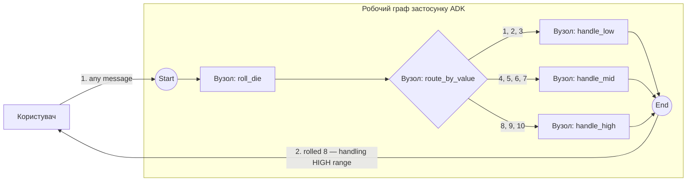

# Приклад маршрутизації — випадкове число → 3 гілки

Найменша наскрізна демонстрація `workflow.IntRoute` / `workflow.MultiRoute` і контракту `Event.Routes`. Без LLM, без HITL, без збереження стану — лише маршрутизація.

- **Ідея:** Числова маршрутизація за допомогою `IntRoute` / `MultiRoute[int]` на основі значення `Event.Routes`.
- **Потрібна LLM?** Ні

## Мета

Кинути випадкове ціле число 1..10 і спрямувати його до одного з трьох обробників залежно від того, у який діапазон воно потрапляє. Показує, як вузол встановлює `Event.Routes` (і `Event.Output`), щоб рушій вибрав відповідне ребро далі за графом.

## Граф



`roll_die` повертає `int`; `route_by_value` породжує подію, у якій `Routes` — це значення, перетворене на рядок, а `Output` — саме значення, тож відповідний обробник отримує типізований `int`. Кожне ребро `MultiRoute[int]` відповідає набору значень (діапазони LOW / MID / HIGH).

## Запуск

```bash
go run . console
```

## Приклад сесії

Введіть будь-яке повідомлення; приклад його ігнорує й кидає нове число на кожному ході, тож гілка змінюється від запуску до запуску (LOW = 1..3, MID = 4..7, HIGH = 8..10):

```text
User -> hi
Agent -> rolled 8 — handling HIGH range (8..10)
```

## Що показує

| Ідея | Де |
|---|---|
| `FunctionNode`, що створює типізоване значення | `roll_die` повертає `int` |
| Власний `BaseNode`, що породжує подію маршрутизації | `route_by_value` встановлює `Event.Routes = []string{fmt.Sprint(value)}` і `Event.Output = value`, щоб подальші FunctionNode отримали типізований вхід `int` |
| `MultiRoute[int]`, що зіставляється з набором int-ів | три ребра далі за графом, по одному на діапазон |
| Випадкова поведінка, щоб задіяти різні шляхи між запусками | `math/rand/v2` у `roll_die` |

## Нотатки

В adk-go `FunctionNode` не може породжувати `Event.Routes`: його обгортка завжди будує одну подію виведення з поверненого значення, тож вузол маршрутизації змушений спуститися до власного `BaseNode`. (В adk-python такого розділення немає — звичайний вузол-функція там може напряму `yield Event(route=...)`.)
