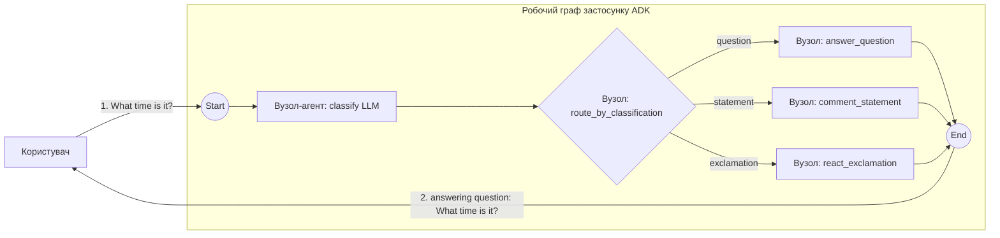

# Приклад маршрутизації за допомогою LLM

Найменший приклад, який використовує справжню LLM як мозок маршрутизації всередині графа. `LlmAgent` класифікує повідомлення користувача в одну з трьох категорій; тривіальна функція Go видає відповідне значення `Event.Routes`, спрямовуючи його до одного з трьох обробників.

- **Ідея:** LLM класифікує, звичайна функція видає маршрут, рушій спрямовує (`NewAgentNode` + `StringRoute`).
- **Потрібна LLM?** Так (Gemini)

Така сама форма, як у прикладі `contributing/workflow_samples/route/` з adk-python (класифікатор на LLM + звичайна функція, що видає подію маршрутизації). Версію без LLM дивіться в [`../string`](../string).

## Мета

Показати канонічний патерн «LLM як мозок, рушій виконує маршрутизацію»: LLM не зберігає стану про маршрутизацію, а логіка маршрутизації лишається у звичайному коді. Класифікатор повертає одне слово; маршрутизатор перетворює його на значення `Event.Routes`; три ребра `StringRoute` спрямовують до відповідного обробника.

## Провайдер і ключі

Провайдера й модель обирають `MODEL` / `DEFAULT_MODEL_PROVIDER`, як у лабораторних дня 3. Ключі покладіть у `apps/.env` (шаблон — `apps/.env-example`) або експортуйте ті самі змінні; модель збирає `internal/modelcfg`:

```bash
# Вибір провайдера й моделі
export DEFAULT_MODEL_PROVIDER=...   # напр. gemini або agentgateway/gemini
export MODEL=...                    # напр. доступна вам модель Gemini

# Облікові дані для обраного провайдера (шаблон містить усі)
export GOOGLE_API_KEY=***
```

Цьому прикладу потрібен саме провайдер **Gemini** (провайдер `gemini` або `agentgateway/gemini`): `LlmAgent` із `modelcfg` повинен мати змогу спрямувати модель до Gemini, інакше класифікатор не працюватиме.

## Граф



## Запуск

```bash
go run . console
```

## Приклад сесії

```text
User -> What time is it?
Agent -> question
answering question: What time is it?

User -> Hello world!
Agent -> exclamation
reacting to exclamation: Hello world!

User -> The sky is blue.
Agent -> statement
commenting on statement: The sky is blue.
```

Перший рядок виведення агента — це класифікація від LLM (вона друкується, бо консольний лаунчер віддає потоком кожну подію з текстовим вмістом). Другий рядок — відповідь обробника.

## Що показує

| Ідея | Де |
|---|---|
| `workflow.NewAgentNode`, що обгортає `LLMAgent` | `classifyNode := workflow.NewAgentNode(classifier, ...)` |
| Відповідь LLM, що потрапляє до наступного вузла | `AgentNode` синтезує фінальну відповідь класифікатора в `Event.Output`, який планувальник подає маршрутизатору як вхід; `LLMAgent.OutputKey = "output"` тут необов'язковий і лише зберігає відповідь у стан сесії |
| Власний `BaseNode`, що перетворює довільний текст від LLM на значення маршруту | `route_by_classification` читає відповідь класифікатора, нормалізує її та видає `Event.Routes` |
| `StringRoute`, що зіставляється з однією з трьох категорій | три подальші ребра, по одному на кожну категорію |
| Обробник, що читає оригінальне повідомлення користувача з `ctx.UserContent` | кожен обробник викликає `userMessage(ctx)`, а не отримує його як вхід графа — вузол маршрутизації передає далі лише класифікацію, а не оригінальний текст |

## Нотатки

### Чому два вузли (класифікатор + маршрутизатор)?

Повторює канонічний патерн adk-python: LLM не зберігає стану про маршрутизацію, а логіка маршрутизації лишається у звичайному коді. Альтернатива — один власний вузол, який викликає LLM і видає `Routes` з того самого тіла Run — коротша, але змішує «рішення на основі LLM» зі «з'єднанням графа» і не використовує жодного звичайного механізму LLMAgent рушія (output_key, телеметрія тощо).

### Чому класифікатор треба зареєструвати в `Config.SubAgents`?

`workflow.NewAgentNode` обгортає `agent.Agent` для виконання в графі, але **не** робить цей агент видимим у дереві агентів раннера (структурі, якою ходить `runner.findAgentToRun`, щоб зіставити `event.Author` з `agent.Agent`). Без явної реєстрації `SubAgents: []agent.Agent{classifier}` раннер логує

```
Event from an unknown agent: classify, event id: ...
```

на кожному ході. Попередження нешкідливе — раннер повертається до `rootAgent` (самого графа), а `isTransferableAcrossAgentTree` блокує будь-яке реальне перемаршрутизування до агента-LLM, бо ланцюг до кореня містить не-LLMAgent (обгортку графа). Проте реєстрація класифікатора як субагента прибирає попередження й тримає дерево агентів узгодженим з графом. Вважайте це обов'язковим шаблонним кодом для будь-якого графа, що обгортає субагента.

### Як змінити модель

Тож установіть `MODEL` (у `apps/.env` або в оточенні) у будь-яку модель, до якої мають доступ ваші облікові дані. Підказка для класифікатора дуже коротка, тож із нею впорається будь-яка сучасна модель Gemini.
