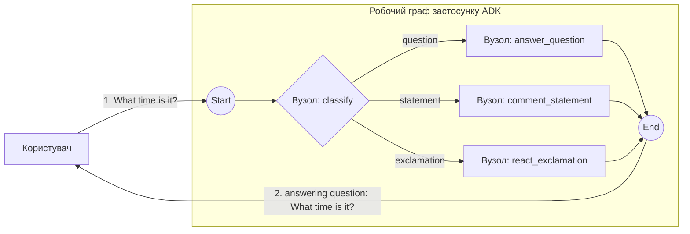

# Приклад маршрутизації за рядком — класифікація повідомлення → 3 гілки

Найменший наскрізний приклад використання `workflow.StringRoute` та контракту `Event.Routes`. Без LLM, без HITL, без випадковості — тривіальний класифікатор обирає маршрут на основі кінцевого розділового знака повідомлення.

- **Ідея:** маршрутизація за рядком через `StringRoute` над значенням `Event.Routes`.
- **Потрібна LLM?** Ні

Версію, де класифікацію виконує LLM, дивіться в [`../llm`](../llm).

## Мета

Класифікувати повідомлення за його кінцевим розділовим знаком (`?` / `!` / інакше) та спрямувати його до одного з трьох обробників. Єдиний вузол `classify` видає і маршрут, і оригінальне повідомлення як виведення, тож кожен обробник отримує повідомлення як типізований `string`.

## Граф



## Запуск

```bash
go run . console
```

## Приклад сесії

Маршрут обирається за кінцевим розділовим знаком повідомлення, тому він цілком детермінований:

```text
User -> What time is it?
Agent -> answering question: What time is it?

User -> The sky is blue.
Agent -> commenting on statement: The sky is blue.

User -> Hello world!
Agent -> reacting to exclamation: Hello world!
```

## Що показує

| Ідея | Де |
|---|---|
| Власний `BaseNode`, що видає подію маршрутизації | `classify` встановлює `Event.Routes = []string{category}` та `Event.Output = msg`, щоб подальші `FunctionNode` отримували оригінальне повідомлення як типізований вхід `string` |
| `StringRoute`, що зіставляється з одним значенням | три подальші ребра, по одному на кожну категорію |
| Прямий порт прикладу `route/` з adk-python, без LLM | класифікатор — це звичайна функція Go, а не `Agent` з `output_schema` |
