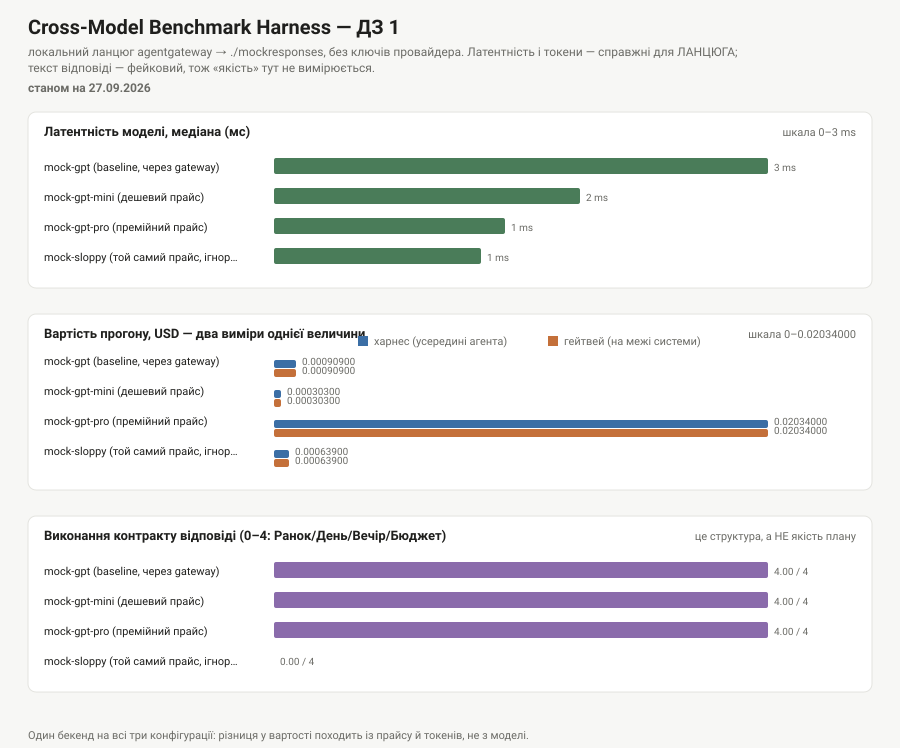

# ДЗ 1 — «Планувальник вихідних у Львові» + Cross-Model Benchmark Harness

**Прогін: 27.09.2026.** Go 1.27.1 · `google.golang.org/adk/v2 v2.4.0` · agentgateway v1.5.0 · gitleaks 8.30.1.

Агент-планувальник вихідних у Львові з **доменною межею, реалізованою в коді**, і
харнес, який міряє латентність, токени й вартість — і перевіряє власну
арифметику **другим, незалежним обчислювачем** (access-log гейтвея).



---

## Чесно про те, що тут виміряно, а що ні

Це найважливіший абзац README, і він стоїть першим навмисно.

У мене **немає ключа жодного провайдера** (ні `GOOGLE_API_KEY`, ні `OPENAI_API_KEY`),
і локальної Ollama теж немає. Тому весь прогін іде через локальний ланцюг
**ADK-агент → agentgateway (:4000) → `./mockresponses` (:8098)**.

| Що в таблиці | Справжнє? | Чому |
|---|---|---|
| Латентність | **так, але це латентність ЛАНЦЮГА** | справжній HTTP через справжній проксі; це не швидкість роздумів моделі, а накладні витрати транспорту |
| Кількість токенів | **так** | їх рахує бекенд і незалежно підтверджує гейтвей |
| Вартість | **так** | реальні токени × оголошена ставка; підтверджена другим обчислювачем |
| Ретраї, backoff, конкурентність | **так** | справжні HTTP 500 від бекенда, справжні паузи |
| Доменна межа (відмова) | **так** | це код, а не поведінка моделі — див. нижче |
| **Якість плану** | **НІ** | текст відповіді написав я, а не модель. Цю колонку я не наводжу взагалі |

Замість «якості» в таблиці стоїть колонка **«формат 0–4»** — машинна перевірка,
чи виконано мій контракт відповіді (`Ранок / День / Вечір / Бюджет`). Це
структура, а не якість: модель може ідеально виконати формат і порадити зимою
пікнік. Але саме цю колонку можна перевірити однаково для всіх конфігурацій, і
вона одразу показує різницю — див. рядок `mock-sloppy` з нулем.

**З ключем усе те саме працює на живих моделях** без зміни коду: `go run . bench -live`.

---

## Як запустити

### Шлях 1 — нуль пререквізитів (без ключа, без Docker, без мережі)

```bash
cd submission/week1/day1
go test ./...
go run . bench -offline
```

### Шлях 2 — повний локальний ланцюг із двома вимірами вартості (потрібен Docker)

```bash
# 1. Підняти гейтвей (уперше — створити .env із ключем для самого гейтвея)
cd demo/1_ai-gateway
cp .env.example .env
sed -i '' "s|^AGENTGATEWAY_API_KEY=.*|AGENTGATEWAY_API_KEY=agw_sk_$(openssl rand -hex 24)|" .env
docker compose up -d

# 2. Підняти бекенд, сумісний з OpenAI Responses API
cd ../../submission/week1/day1
go run ./mockresponses &          # :8098

# 3. Прогнати бенчмарк
export AGENTGATEWAY_BASE_URL=http://localhost:4000/v1
export AGENTGATEWAY_API_KEY=$(grep '^AGENTGATEWAY_API_KEY=' ../../../demo/1_ai-gateway/.env | cut -d= -f2)
go run . bench -n 5 -parallel 4
go run . faults                   # fault injection: справжні 500-ки + backoff
```

### Шлях 3 — живі моделі

```bash
echo "GOOGLE_API_KEY=..." >> apps/.env     # .env у git не їде, див. §Безпека
go run . bench -live -n 3
```

### Один діалог

```bash
echo "Склади план на суботу у Львові для двох, бюджет до 1000 грн." | go run . console
```

---

## Чому `./mockresponses`, а не `mock-llm` із курсового демо

Це найдорожчий урок цієї лаби, і він коштував пів години.

`mock-llm` із `demo/1_ai-gateway` реалізує `POST /v1/chat/completions`. ADK Go
v2.4.0 у пакеті `openaimodel` говорить **виключно OpenAI Responses API** —
`POST /v1/responses` (див. `client.Responses.New` у сорсах ADK). Ланцюг рвався
на 400, і виглядало це як поломка гейтвея, якою не було: гейтвей чесно проксював
шлях, якого в бекенді просто немає.

> **«OpenAI-сумісний» — це не одна сумісність, а мінімум дві несумісні між собою.**
> Перед вибором провайдера чи проксі за фразою «OpenAI-compatible» перевіряйте,
> ЯКИЙ саме API він реалізує — chat completions чи responses. Інакше ви дізнаєтесь
> це з 400-ки на першому запиті.

`./mockresponses` — мої ~180 рядків, які цю межу закривають. Курсові файли я не
чіпав (крім конфігу гейтвея, куди додав маршрут `mock/*` і прайс — див. нижче).

---

## Результати

### Таблиця (n=5 на пару «конфігурація × промпт», 4 промпти, стеля паралелізму 4)

| Конфігурація | Модель | n | латентність медіана (min–max) | токени in/out | $ харнес | $ гейтвей | ретраїв | формат 0–4 | станом на |
|---|---|---:|---|---:|---:|---:|---:|---:|---|
| mock-gpt (baseline) | `mock/mock-gpt` | 20 | 2 ms (1–11 ms) | 3180/720 | 0.00090900 | 0.00090900 | 0 | 4.00 | 27.09.2026 |
| mock-gpt-mini (дешевий прайс) | `mock/mock-gpt-mini` | 20 | 2 ms (1–3 ms) | 3180/720 | 0.00030300 | 0.00030300 | 0 | 4.00 | 27.09.2026 |
| mock-gpt-pro (премійний прайс) | `mock/mock-gpt-pro` | 20 | 2 ms (1–3 ms) | 3180/720 | 0.02034000 | 0.02034000 | 0 | 4.00 | 27.09.2026 |
| mock-sloppy (той самий прайс, ігнорує контракт) | `mock/mock-sloppy` | 20 | 1 ms (1–3 ms) | 3180/**270** | 0.00063900 | 0.00063900 | 0 | **0.00** | 27.09.2026 |

Сирі дані: [`results/bench.json`](results/bench.json) · таблиця: [`results/bench.md`](results/bench.md) · графік: [`results/bench.svg`](results/bench.svg).

### Що з цієї таблиці справді видно

1. **Два незалежні обчислювачі зійшлися до останнього знака.** Колонки «$ харнес»
   і «$ гейтвей» збігаються в усіх чотирьох рядках. Це не одне число, показане
   двічі: харнес рахує з `usage`, який бачить агент, гейтвей — із того, що
   справді пройшло через нього, за власним каталогом цін. Якби я помилився в
   ставці або поділив на 1000 замість 1 000 000, колонки б розійшлися.
2. **Прайс ≠ рахунок.** `mock-sloppy` має **той самий прайс**, що baseline, але
   коштує **на 30 % дешевше** (0.00063900 проти 0.00090900) — бо його відповідь
   коротша: 270 вихідних токенів проти 720. І саме він єдиний **провалює
   контракт** (формат 0.00). Дешевше — тому що гірше. Це той компроміс, який
   зникає з будь-якої таблиці, відсортованої за ціною.
3. **Розкид важливіший за медіану.** У baseline max = 11 ms при медіані 2 ms:
   перший запит платить за встановлення з'єднання. Середнє тут збрехало б.

> Таблиця свідомо **не відсортована** за жодною метрикою. Сортування за ціною
> чи латентністю — це вже рейтинг, а рейтинг ховає компроміс. Закріплено тестом
> `TestSummarizeIsMeasurementNotRanking`.

---

## Три діалоги + context-stress

Повні транскрипти: [`results/dialogues.txt`](results/dialogues.txt).

### 1. План на суботу

```
── запит: Склади план на суботу у Львові для двох людей, бюджет до 1000 грн.
── відповідь:
Ранок: Високий замок — панорама міста, 1.5 години, вхід вільний.
День: обід у Старому місті + Аптека-музей, ~2 години, 350–500 грн.
Вечір: Львівська опера або концерт у філармонії, за наявності квитків.
Бюджет: 700–1100 грн на двох.
── межа домену спрацювала: false · викликів моделі: 1 · токени in/out: 193/48 · вартість: $0.00005775
```

Контракт відповіді виконано (формат 4/4). **Але текст написав мій мок**, тому
читати тут можна лише ліву частину: ланцюг працює, токени рахуються, вартість
рахується.

### 2. «А якщо дощ?»

```
── запит: А якщо в суботу цілий день дощ? Переплануй.
── відповідь: (та сама структура) · токени in/out: 188/48 · вартість: $0.00005700
```

**Чесно: цей діалог на моку нічого не доводить.** Мок повертає ту саму заготовку
незалежно від питання, тож справжнього перепланування тут немає — є доказ, що
другий запит іде в новій сесії (вхідних токенів 188, а не 193+48: історія
першого запиту не тягнеться). З живим ключем та сама команда дає справжнє
перепланування.

### 3. Поза доменом — і ось тут найцікавіше

```
── запит: Порахуй мені податок на доходи ФОП 3 групи за квартал і склади декларацію.
── відповідь:
Це поза моїм доменом: я планувальник вихідних у Львові — дозвілля, події, їжа, погода, маршрути.
── межа домену спрацювала: true · викликів моделі: 0 · токени in/out: 0/0 · вартість: $0.00000000
```

**`викликів моделі: 0`** — ось що тут головне, а не текст відмови.

Відмова в цьому агенті — це **не прохання до моделі**, а властивість системи.
Вона реалізована як `BeforeModelCallback` (`DomainGuard` у [`agent.go`](agent.go)):
ADK документує, що перший callback, який повернув не-nil `LLMResponse`, **скасовує
виклик моделі**. Наслідки, які видно в рядку вище:

- відмова **детермінована** — її покриває тест, а не «прогнали й подивились»;
- відмова **безкоштовна** — нуль токенів, нуль латентності, `$0.00000000`;
- відмова **не залежить від моделі** — підставте будь-яку, поведінка та сама.

Інструкція в промпті теж просить відмовлятися (правило 4). Але інструкція
слабшає з кожним рядком контексту й тримається на тому, що модель її послухає.
Код — не слабшає. Тест: `TestDomainGuardRefusesWithoutCallingTheModel` перевіряє
саме `CallCount() == 0`, тобто **гроші**, а не текст.

Межа навмисно **асиметрична**: хибне спрацювання дає користувачу зрозумілу
відмову (він переформулює), а пропуск дає агента, який упевнено відповідає поза
компетенцією. Друге дорожче.

### 4. Context-stress — де контекст допоміг, а де потрібен RAG

Агенту передано внутрішній довідник із 5 локацій (години роботи — **лише субота**),
і поставлено питання про **неділю**:

```
── відповідь (offline-режим, скриптована модель):
У переданому довіднику немає годин роботи на неділю для галереї "Дзиґа" —
у ньому є лише субота (сб 11:00–19:00, вхід 120 грн). Назвати неділю я не можу,
не вигадавши її. Потрібен або рядок довідника з неділею, або пошук по сайту локації.
── токени in/out: 216/41
```

**Де контекст допоміг:** усе, що є в довіднику (адреси, суботні години, ціни),
агент віддає точно й без пошуку. Довідник у промпті — це найдешевший і
найнадійніший RAG, який існує: нуль інфраструктури, нуль затримки, нуль ризику
дістати не той документ.

**Де він ламається — три межі, і всі три видно на цьому прикладі:**

1. **Межа повноти.** Даних про неділю в контексті немає. Модель або чесно каже
   це, або вигадує — третього не буває. Прохання «не вигадуй» у промпті знижує
   ймовірність, але не робить її нулем.
2. **Межа обсягу.** П'ять локацій влазять у промпт. П'ять тисяч — ні, і платити
   за них у **кожному** запиті ніхто не буде. Ось де починається RAG: не тому,
   що так модно, а тому, що ви більше не можете дозволити собі покласти в
   контекст усе.
3. **Межа свіжості.** Довідник у промпті — це знімок. Години роботи міняються,
   подія скасовується. Для цього потрібен пошук, а не контекст.

**Висновок для цієї лаби:** контекст — для того, що мале й стабільне; пошук — для
того, що змінюється (погода, афіша); RAG — для того, що велике. Плутати їх дорого
в обидва боки: RAG там, де вистачило б п'яти рядків у промпті, — це інфраструктура
заради інфраструктури.

---

## ++ Advanced

### 1. Конкурентний бенчмарк: goroutines + errgroup + retry/backoff

`RunAll` у [`bench.go`](bench.go) розкладає всі пари «конфігурація × промпт × n»
і виконує їх через `errgroup` зі стелею (`SetLimit`).

Чому конкурентність тут — **умова коректності**, а не оптимізація: послідовний
прогін чотирьох конфігурацій розтягується в часі, і четверта модель міряється в
іншій мережевій обстановці, ніж перша. Чому стеля обов'язкова: «однакові промпти
на всі моделі одночасно» без стелі — найшвидший спосіб самому собі зробити 429,
після чого бенчмарк починає міряти власний rate limit.

`errgroup` тут **не** для fail-fast: помилка одного прогону їде в `Sample.Err` і
в таблицю. Таблиця на три рядки з четвертим «помилка» інформативніша за
відсутність таблиці (`TestRunAllKeepsGoingAfterOneFailure`).

**Retry** (`Retry` + `RetryPolicy`): експонента × full jitter, стеля затримки,
і — головне — **консервативний класифікатор** `IsTransient`. Повторюємо 429, 5xx,
обриви, таймаути. **Не** повторюємо 400/401 і скасований контекст: чотири спроби
на 401 — це вчетверо довше повідомлення про ту саму проблему.

Тести: `TestRetrySucceedsAfterTransientFailures` (перевіряє, що затримка **росте**),
`TestRetryDoesNotRepeatPermanentErrors`, `TestRetryStopsAtLimit`,
`TestDelayGrowsAndIsCapped`, `TestRunAllRespectsParallelLimit`.

### 2. Fault injection на справжніх 500-ках — і несподіванка

[`results/faults.txt`](results/faults.txt), `go run . faults`:

```
  спроба 1 за 1.323s → помилка: transient=true
  спроба 2 за 1.396s → помилка: transient=true
  спроба 3 за 1.338s → помилка: transient=true
  спроба 4 за 1.403s → помилка: transient=true
── спроб: 4 (стеля 4) · загальний час із паузами backoff: 6.95s
── фінальна помилка: … 500 Internal Server Error {"message":"simulated upstream failure…"}
── гейтвей побачив: запитів 12, статуси map[500:12], вартість $0.00000000
```

**Мій харнес зробив 4 спроби. Гейтвей побачив 12 запитів.**

Це не помилка вимірювання — це **амплітуда ретраїв**. SDK `openai-go` усередині
ADK має власний ретрай (≈3 запити на виклик), і він множиться на мій: 4 × 3 = 12.
Наслідки, про які варто знати до продакшну, а не після рахунку:

- ваш «ліміт 4 спроби» насправді означає 12 запитів до апстріму;
- на 429 це не пом'якшує шторм, а **підсилює** його втричі;
- порахувати це зсередини агента неможливо — видно лише **на межі системи**.

Правильна реакція — не додавати ще один рівень ретраїв, а знати про всі рівні й
вимикати зайві. Це та сама теза, що й у вартості: міряти треба на межі.

Зверніть увагу й на останній рядок: усі 4 (12) невдалі спроби завершилися
**чесною помилкою**, а не вигаданою відповіддю. Агент, який на збій апстріму
відповідає «ось ваш план», гірший за агента, який падає.

### 3. Два виміри однієї вартості

Ключовий результат — колонки «$ харнес» і «$ гейтвей» у таблиці вище **збігаються**.

| | Що міряє | Звідки бере |
|---|---|---|
| Харнес | те, що бачить **агент** | `UsageMetadata` у відповіді × ставка з `Config` |
| Гейтвей | те, що пройшло **через межу системи** | власний підрахунок токенів × `modelCatalog` у своєму конфізі |

Це два **незалежні** обчислювачі: різні джерела токенів, різні таблиці цін, різні
процеси. Перевірка арифметики зафіксована тестом
`TestCostArithmeticMatchesGatewayCatalog`, де очікувані значення взяті **з
access-log гейтвея**, а не з мого коду:

```
gen_ai.request.model=mock-gpt   input_tokens=9 output_tokens=12  agw.ai.usage.cost.total=0.00000855
gen_ai.request.model=mock-gpt-mini                               agw.ai.usage.cost.total=0.00000285
gen_ai.request.model=mock-gpt-pro                                agw.ai.usage.cost.total=0.000207
```

**Чому це взагалі важливо.** Коли наприкінці місяця в рахунку стоїть $2 800, а у
вашій табличці — $40, сперечатися ви будете без доказів. Збіг двох незалежних
вимірів — це і є доказ. А розбіжність між ними — сигнал: агент не бачить ні
ретраїв транспорту (див. 4 проти 12 вище), ні кешованих префіксів, ні того, що
маршрут підмінив модель.

Ланцюг: `JoinGatewayCost` зводить агрегати за іменем моделі (зрізаючи префікс
маршруту), а не за `trace.id` — агент свого `trace.id` не знає. Це свідоме
спрощення, і воно не вдає точності, якої тут немає: порівнюються **суми за вікном
прогону**.

### 4. Сканування всієї історії, а не тільки staged

Pre-commit хук ловить лише те, що ви комітите **зараз**. Цього недостатньо з
трьох причин, і кожна — реальна:

1. хук **обходиться** одним прапорцем: `git commit --no-verify`;
2. хук **нічого не знає** про коміти, зроблені до його встановлення;
3. хук живе через `git config core.hooksPath`, а `.git/config` **не версіонується** —
   файл приїде з клоном, а увімкнення ні.

CI-крок, який закриває всі три: [`.github/workflows/gitleaks.yml`](../../../.github/workflows/gitleaks.yml)
— `gitleaks git --log-opts="--all"` по **всій** історії, на кожен push і PR.

### 4a. CI знайшов справжній секрет — і це не навчальний приклад

CI-крок із п. 4 я не просто написав, а **запустив по історії цього репозиторію**.
Він знайшов **3 знахідки в 17 коммітах** — і це виявився справжній
захардкоджений приймальний ключ agentgateway:

```
RuleID:      generic-api-key
File:        demo/1_ai-gateway/config/agentgateway.yaml   (і demo/1_ai-gateway/config.yaml)
Commit:      114197b (21.09.2026), 6a75145 (21.09.2026)
```

У конфізі стояло два приймальні ключі: перший через змінну
(`${AGENTGATEWAY_API_KEY:-…}`), другий — `agw_sk_…` **рядком у файлі**, у
публічному репозиторії. Будь-хто, хто підняв цей стек і відкрив :4000 назовні,
роздавав доступ до свого гейтвея за ключем, який лежить на GitHub.

**Це рівно той випадок, який pre-commit хук зловити не міг:** коміти зроблено
21.09.2026, тобто до того, як хук з'явився в моєму клоні. Хук дивиться вперед,
CI — назад. Потрібні обидва.

Що я зробив і чого свідомо **не** робив:

| Дія | Зробив? |
|---|---|
| Прибрав ключ із робочого дерева, лишивши коментар із поясненням | ✅ |
| Перевірив, що гейтвей далі працює, а старий ключ **відхиляється** | ✅ `HTTP 200` / `HTTP 401` |
| Вніс коміти в baseline `.gitleaks.toml`, щоб CI був зелений | ❌ **спробував і відкотив** — див. нижче |
| Переписав історію (`git filter-repo`) | ❌ ключ уже в клонах і в кеші GitHub — переписування нічого не відкликає |
| Вважав питання закритим | ❌ **ключ треба перевипустити на стороні, яка його видала** |

**Baseline я спробував — і це була помилка, яку варто описати.** Спершу я заніс
два коміти в allowlist `.gitleaks.toml`, щоб CI був зелений. Провалилося двічі:

1. **Крихко.** Локально в моєму клоні було 17 комітів і дві знахідки. У CI на
   повному форку — 36 комітів і три: той самий ключ жив ще в коміті `7d7694a`,
   якого в мене просто не було. Перелічити коміти з секретом наперед не вийде.
2. **Неправильно по суті.** Allowlist, доданий заради зеленого CI, — це рівно
   те, від чого застерігає коментар угорі того самого `.gitleaks.toml`: саме так
   пізніше й комітять справжній ключ.

Правильне рішення — розділити перевірки за **відповідальністю**, а не приховати
знахідку:

| Робота | Роль | Що перевіряє |
|---|---|---|
| `working-tree` | **блокує** | у коді, який пишемо ми, секретів немає — це наша відповідальність |
| `history` | інформаційна (`continue-on-error`) | успадкований борг у чужій історії; стане блокуючою після ротації ключа |

Постійно червоний CI нікого не захищає — його перестають читати за тиждень.
А зелений CI, який мовчить про справжній секрет, гірший за червоний.

Останній рядок і є вся суть §6 нижче: сканер знаходить секрет, а не прибирає його.

### 5. ADK Go проти ADK Python

Go-версія дала три речі, які я відчув саме в цій лабі:

1. **Один бінарник, нуль оточення.** `go run .` — і все; ні venv, ні
   `requirements.txt`, ні конфлікту версій. Для харнесу, який має запуститися в
   CI та на чужій машині, це не зручність, а умова відтворюваності.
2. **Типізований контракт замість дикту.** `model.LLMResponse` і
   `GenerateContentResponseUsageMetadata` — це структури: поле, якого немає,
   ловить компілятор, а не `KeyError` на третьому прогоні бенчмарку.
3. **Конкурентність — вбудована.** `errgroup.SetLimit` + горутини дають
   конкурентний бенчмарк на 15 рядків. У Python це `asyncio` (і тоді весь стек
   має бути async) або пул потоків із GIL.

Що зручніше в Python: екосистема навколо (готові токенайзери, pandas для
агрегації, matplotlib для графіка — я SVG малював руками), швидший цикл правок
без перекомпіляції, і значно більше прикладів в інтернеті. Плюс в ADK Go **немає
Anthropic-бекенда** — у Python вибір провайдерів ширший.

### 6. Процедура ротації злитого ключа

**Головна теза: сканер не «прибирає» секрет.** Переписування історії
(`git filter-repo`) не відкликає ключ — він уже в чиємусь клоні, у кеші GitHub, у
логах CI, у чиємусь дампі.

1. **Відкликати й перевипустити ключ у консолі провайдера. Це крок №1, не №3.**
   Усе інше — прибирання після, і воно нічого не рятує, поки ключ живий.
2. Перевірити білінг і логи використання за період від коміту до відкликання:
   чи ключем уже користувалися.
3. Замінити ключ у `.env`, у секретах CI та в усіх середовищах; перезапустити те,
   що його читає при старті.
4. Тільки тепер чистити історію (`git filter-repo --invert-paths`), примусово
   пушити й **попередити всіх**, хто має клон: їхні копії старої історії
   лишаються валідними й містять секрет.
5. Додати CI-крок по всій історії (п. 4 вище) і baseline, щоб той самий секрет не
   заблокував кожен наступний коміт.
6. Записати інцидент: що саме злило ключ. Майже завжди це не зловмисник, а
   `.env`, який не потрапив у `.gitignore`.

---

## Безпека: доказ, що anti-leak хук працює саме тут

Повний вивід: [`results/gitleaks-hook-proof.txt`](results/gitleaks-hook-proof.txt).

```console
$ git config core.hooksPath .githooks
$ printf 'GOOGLE_API_KEY=AIzaSy...\n' > leak-probe.txt && git add leak-probe.txt
$ git commit -m "probe: this must be blocked"

Finding:     GOOGLE_API_KEY=REDACTED
RuleID:      gcp-api-key
Entropy:     4.907072
File:        leak-probe.txt
WRN leaks found: 1
❌ Коміт заблоковано: у staged-змінах знайдено секрет.

$ git log -1 --format=%s
Feat/docs (#19)          # ← HEAD не зрушив: коміт справді не пройшов
```

Перевірено на **gitleaks 8.30.1**, форма команди — `gitleaks git --staged`
(`protect`/`detect` приховані з v8.19).

Додатково я узагальнив `.gitignore` у корені: замість переліку конкретних шляхів
(`apps/.env`, `demo/1_ai-gateway/.env`) тепер стоять `.env`, `.env.*` і виключення
`!.env.example`. Причина проста: наступна тека з `.env` — а вона буде — інакше
знову поїхала б у репозиторій.

---

## Карта термінів: що кожен із них означає саме в цій лабі

| Термін | Що це в моєму коді | Де подивитись |
|---|---|---|
| **LLM** | бекенд за інтерфейсом `model.LLM`. У мене їх три реалізації: `openaimodel` через гейтвей, `gemini` напряму і мій `scriptedModel` для офлайну. Агент не знає, з ким говорить, — у цьому весь сенс інтерфейсу | `BuildModel`, `scriptedModel` |
| **Prompt** | два різні тексти, які легко сплутати: **системна інструкція** (`instruction` — формат, правила, домен) і **запит користувача**. Платите ви за обидва, у кожному виклику. У цій лабі інструкція більша за запит: 193 вхідні токени на питання в 12 слів | `agent.go:instruction` |
| **Context window** | бюджет робочої пам'яті на один виклик. Видно в дії на context-stress: довідник у промпті працює як RAG, поки влазить. Історія в контекст **не** тягнеться — кожен прогін іде у власній сесії, інакше я вимірював би зростання контексту, а не модель | `labrun.Run`, §Context-stress |
| **Tool** | функція, яку модель може викликати. Тут — `geminitool.GoogleSearch{}`, і він підключається **лише** на бекенді Gemini: OpenAI-сумісний маршрут відхилить незнайомий tool | `NewAgent(m, withSearch)` |
| **Agent** | LLM + інструкція + інструменти + **політики навколо них**. Останнє й відрізняє агента від виклику API: у мене це `DomainGuard` (межа домену) і `Meter` (спостережуваність) на callbacks | `agent.go` |
| **RAG** | тут його **немає**, і це свідомо. Довідник у промпті — його вироджений випадок. Де закінчується промпт і починається RAG — три межі в §Context-stress | §Context-stress |
| **MCP** | теж немає — tool-и локальні, у Go-коді. MCP зробив би tool **зовнішньою межею процесу** з власною `inputSchema`. Це ДЗ 2 | [ДЗ 2](../day2/README.md) |
| **Gateway** | проксі між агентом і моделлю. Агент думає, що говорить із OpenAI; насправді кожен виклик отримує трасу, метрику й **незалежно пораховану вартість** | `gateway.go`, §Два виміри |

---

## Висновок: яку модель я лишив би цьому агенту

Чесна відповідь на моїх даних: **з цього прогону вибрати модель не можна**, і
вдавати протилежне було б найгіршим, що я міг би написати в README. Бекенд один
і той самий, тексту від справжньої моделі я не бачив.

Що прогін **дозволяє** сказати — це як я вибиратиму, коли з'явиться ключ:

1. **Спочатку контракт, потім ціна.** Рядок `mock-sloppy` — найкоротша ілюстрація:
   він на 30 % дешевший за baseline при **тому самому прайсі** (менше вихідних
   токенів) і при цьому єдиний провалює формат. Модель, яка не тримає контракт
   відповіді, не входить у порівняння за ціною взагалі — її вихід усе одно
   доведеться ремонтувати, і цей ремонт коштує дорожче за різницю в тарифі.
2. **Ціну рахувати за задачу, а не за мільйон токенів.** Прайс-лист говорить про
   ставку; рахунок формують вихідні токени, а їх визначає багатослівність
   моделі. Ці числа не корелюють.
3. **Найдешевшу частину роботи не віддавати моделі взагалі.** Найкращий рядок у
   моїй таблиці — той, де `викликів моделі: 0` і `$0.00000000`. Кожен запит,
   який зупиняє детермінований код (доменна межа, валідація, кеш), — це запит із
   нульовою вартістю, нульовою латентністю і стовідсотковою передбачуваністю.
   Вибір моделі важливий; вибір **не викликати** її важливіший.
4. **За замовчуванням — дешева модель + жорсткий контракт**, а дорога тільки там,
   де заміряно, що дешева контракт не тримає. Порядок саме такий: спершу замір,
   потім апгрейд.

---

## Файли

| Файл | Що в ньому |
|---|---|
| [`agent.go`](agent.go) | інструкція агента, `DomainGuard` (межа в коді), `Meter`, `BuildModel` |
| [`bench.go`](bench.go) | ADK-free ядро: вартість, `Retry`/`RetryPolicy`, `RunAll` на errgroup, агрегація, таблиця |
| [`runner.go`](runner.go) | шов ADK ↔ харнес; `scriptedModel` для офлайн-режиму |
| [`gateway.go`](gateway.go) | парсер access-log гейтвея — другий вимір вартості |
| [`chart.go`](chart.go) | рендер SVG без залежностей |
| [`main.go`](main.go) | CLI: `bench`, `console`, `faults`; конфігурації й промпти |
| [`mockresponses/`](mockresponses/) | бекенд, сумісний з OpenAI **Responses API** (те, чого бракувало) |
| `*_test.go` | 26 тестів: межа домену, вартість, ретраї, конкурентність, парсер логу, SVG |
| [`results/`](results/) | артефакти прогону 27.09.2026 |

## Що я змінив поза цією текою

| Файл | Зміна | Навіщо |
|---|---|---|
| `.gitignore` (корінь) | узагальнив правила `.env` | Крок 0.2 ДЗ: перелік конкретних шляхів не захищає наступну теку |
| `demo/1_ai-gateway/config/agentgateway.yaml` | провайдер `mock`, маршрут `mock/*`, inline-прайс | без маршруту гейтвей не знає про локальний бекенд, без прайсу не рахує вартість |
| `.github/workflows/gitleaks.yml` | новий | ++ Advanced: скан усієї історії |
