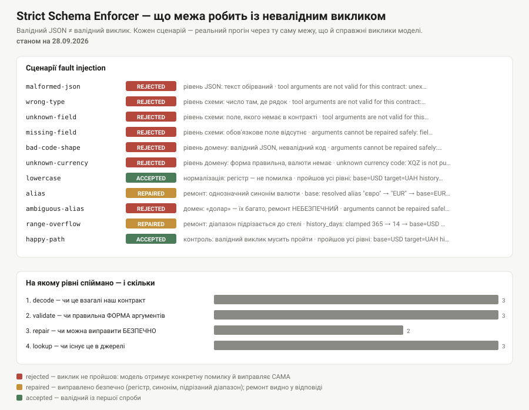

# ДЗ 2 — Strict Schema Enforcer: типізований інструмент курсу валют

**Прогін: 27–28.09.2026.** Go 1.27.1 · `google.golang.org/adk/v2 v2.4.0` · джерело даних — **живий API НБУ** (без ключа).

Типізований `functiontool` із трирівневим вкладеним контрактом, доменною
валідацією, циклом «валідація → ремонт → повторна валідація» і fail path, який
повертає чесну помилку замість вигаданого курсу.



---

## Що тут справжнє, а що скриптоване

На відміну від ДЗ 1, тут **дані справжні**: курси тягнуться з публічного API
НБУ прямо під час прогону, без ключа.

| Що | Справжнє? |
|---|---|
| Курси, дати, історія по днях | **так** — живий `bank.gov.ua`, без ключа |
| Інструмент, схема, валідація, цикл ремонту | **так** |
| Помилки й fail path | **так** — включно з реальним 503 у тестах через `httptest` |
| Кеш і поле `source.kind` | **так** — другий виклик у діалозі чесно позначений `cache` |
| **Репліки моделі** (які tool-call-и робити) | **ні, скриптовані** — ключа провайдера немає |

Тобто діалог №2 доводить не «модель здогадалася виправитись», а **«коли модель
виправляється, межа системи поводиться саме так»**: перший виклик відхилено з
конкретною помилкою, другий прийнято, число реальне й має походження. З ключем
та сама команда працює з живою моделлю: `go run . ask`.

---

## Як запустити

```bash
cd submission/week1/day2

go test ./...                  # 32 тести, без ключа й без мережі
go run . quote USD UAH 5       # прямий виклик інструмента проти живого НБУ
go run . demo                  # чотири діалоги
go run . faults                # fault injection: таблиця + JSON + SVG
go run . schema                # автогенерована схема поруч із явною

go run . quote USD UAH 5 -offline    # без мережі, на фікстурі
echo "Курс євро?" | go run . ask     # жива модель (потрібен GOOGLE_API_KEY)
```

---

## Контракт: три рівні, масив, enum

```
RateQuote                        ← рівень 1
├── pair     Pair                ← рівень 2
├── rate     float64
├── as_of    string
├── source   Source              ← рівень 2
│   └── kind SourceKind          ← ENUM: "api" | "cache" | "mock"
├── history  []HistoricalPoint   ← рівень 2, МАСИВ
│   └── [n].source Source        ← рівень 3
│       └── kind SourceKind      ← ENUM
└── note     string              ← опційне (див. §Schema-міграція)
```

Схема генерується **автоматично** з Go-структур — жодного рукописного JSON
Schema (крім явної `InputSchema`, яка існує спеціально для порівняння).
Подивитись згенероване: `go run . schema`, збережено в
[`results/schema.txt`](results/schema.txt).

### Чому кожна точка історії несе ВЛАСНИЙ `source`

Це не надлишковість. Сьогоднішній курс приходить із живого API, вчорашній може
приїхати з кешу. Один `source` на всю відповідь **брехав би про половину чисел** —
і брехав би саме в полі, яке існує, щоб числу можна було довіряти.

Живий приклад із [`results/dialogues.txt`](results/dialogues.txt): перший виклик
у прогоні має `"kind":"api"`, наступні — `"kind":"cache"`. Enum не декоративний,
він змінюється.

### Реальний вихід (живий НБУ, `go run . quote USD UAH 5`)

```json
{
  "pair": { "base": "USD", "target": "UAH" },
  "rate": 44.8414,
  "as_of": "2026-09-28",
  "source": { "kind": "api", "name": "nbu", "fetched_at": "2026-09-27T13:21:25Z" },
  "history": [
    { "date": "2026-09-22", "rate": 44.7071,
      "source": { "kind": "api", "name": "nbu", "fetched_at": "2026-09-27T13:21:25Z" } },
    { "date": "2026-09-23", "rate": 44.7863, "source": { "kind": "api", … } },
    { "date": "2026-09-24", "rate": 44.8571, "source": { "kind": "api", … } }
  ]
}
```

Днів у відповіді менше, ніж запитано: у вихідні НБУ курсу **не публікує**, і
такі дні пропускаються, а не заповнюються вчорашнім числом. Заповнити їх
означало б вигадати котирування, якого не було.

---

## Валідний JSON ≠ валідний виклик

Це теза дня, і вона зафіксована тестом `TestValidJSONIsNotAValidCall`:

```go
raw := []byte(`{"base": "US1", "target": "UAH"}`)

in, err := DecodeArgs(raw)   // err == nil: JSON ВАЛІДНИЙ
_, err = in.Validate()       // err != nil: виклик НЕ валідний
// invalid currency code: "US1" must be three LATIN letters (ISO 4217); "1" is not one
```

Зверніть увагу на дві речі. По-перше, `json.Unmarshal` не поскаржився — схема
довела **форму**. По-друге, помилка називає **конкретне значення** (`"US1"`) і
конкретний символ. Саме цей рядок побачить модель, і саме за ним вона виправить
власний виклик. «Invalid arguments» не дало б їй нічого, і наступна спроба була
б такою самою.

---

## Чотири рівні межі — і що ловить кожен

`go run . faults` ганяє 12 навмисно зіпсованих викликів через ту саму межу, що й
справжні. Повна таблиця: [`results/faults.md`](results/faults.md), сирі дані:
[`results/faults.json`](results/faults.json).

| Сценарій | Рівень | Вердикт | Що побачить модель |
|---|---|---|---|
| `malformed-json` | decode | **rejected** | `unexpected EOF` |
| `wrong-type` | decode | **rejected** | `cannot unmarshal number into RateInput.base` |
| `unknown-field` | decode | **rejected** | `unknown field "currency"` |
| `missing-field` | validate | **rejected** | `field "target": currency code is empty` |
| `bad-code-shape` | validate | **rejected** | `"US1" must be three LATIN letters` |
| `unknown-currency` | **lookup** | **rejected** | `XQZ is not published by this provider` |
| `lowercase` | — | accepted | нормалізація регістру — не помилка |
| `alias` | repair | **repaired** | `resolved alias "євро" → "EUR"` |
| `ambiguous-alias` | validate | **rejected** | `"долар" must be three letters` — і це правильно |
| `range-overflow` | repair | **repaired** | `history_days: clamped 365 → 14` |
| `happy-path` | lookup | accepted | контроль: валідний виклик мусить пройти |
| `unknown-enum` | **output** | **rejected** | `source.kind "аpi" must be one of api, cache, mock` |

Рівні навмисно розділені, бо плутати їх дорого:

1. **decode** — чи це взагалі наш контракт. Найдешевший рівень, ловить те, що
   до домену не має стосунку.
2. **validate** — чи правильна **форма** аргументів. Мережі не потребує.
3. **repair** — чи можна виправити **безпечно** (див. нижче).
4. **lookup** — чи існує це в джерелі. **Єдиний рівень, який коштує запиту.**
5. **output** — чи можна довіряти тому, що джерело ВІДПОВІЛО.

Останній рядок, `unknown-enum`, — це інший напрямок межі, і його легко проґавити.
Аргументи там бездоганні; поза контрактом виявляється **відповідь джерела**:
`source.kind` приходить як `"аpi"` з **кириличною «а»**. Такий рядок проходить
будь-яку перевірку «це непорожній текст» і ламається мовчки через тиждень —
у коді споживача, далеко від місця помилки.

Поки провайдер свій, санітизація виходу здається параноєю. Щойно він стає чужим
MCP-сервером, це єдине, що стоїть між вами й значенням, якого ви не чекали.

Ключовий рядок таблиці — `unknown-currency`. `XQZ` проходить decode і validate:
форма бездоганна, три латинські літери. Що такої валюти не існує, знає лише
джерело — і це принципово окремий рівень. Помилка рівня домену, подана як «bad
request», відправила б модель виправляти **тип** замість **значення**.

---

## Межа між ремонтом і відмовою

Найважливіше рішення в цьому ДЗ — не «як зробити цикл ремонту», а **де він має
зупинятися**.

> **Ремонтувати можна лише те, що не може змінити зміст.
> Все інше — це відмова з поясненням, а не здогад.**

| Вхід | Дія | Чому |
|---|---|---|
| `"usd"` → `USD` | нормалізація | та сама валюта, інший регістр |
| `"  eur "` → `EUR` | нормалізація | пробіли не несуть змісту |
| `"євро"` → `EUR` | **ремонт** | однозначна назва тієї самої валюти |
| `history_days: 365` → `14` | **ремонт** | надмірна вимога, не помилка змісту; віддаємо максимум і кажемо про це |
| `"US1"` | **відмова** | одруківка. `USD`? `USh`? Це здогад |
| `"USDD"` | **відмова** | те саме |
| `"долар"` | **відмова** | **доларів багато**: USD, CAD, AUD, SGD. Вибрати один — це вибрати за користувача |
| `""` | **відмова** | порожнє поле не має безпечного заповнення |

Рядок «долар» — найважливіший. Спокуса «ну очевидно ж USD» велика, а ціна
помилки — конвертація не в ту валюту, яка **не падає**, не ловиться тестами і
виявляється в рахунку. Інструмент, який здогадується про гроші, помиляється
рідко й дорого.

Ремонт ще й **видимий**: відремонтована відповідь несе `note`
(`arguments were normalized before lookup: base: resolved alias "євро" → "EUR"`).
Тихий ремонт заборонений тестом `TestRepairIsVisibleInTheAnswer` — інакше
одного дня він відповість про іншу валюту й ніхто не зрозуміє, звідки число.

Ліміт спроб конфігурований (`RepairPolicy.MaxAttempts`, дефолт 2: валідація →
безпечний ремонт → валідація). Чому не більше: цикл, який пробує багато разів,
починає **підбирати** аргументи, а підбір у домені грошей — це не стійкість, а
замаскована вигадка.

---

## Чотири діалоги

Повні транскрипти з реальними викликами: [`results/dialogues.txt`](results/dialogues.txt).

### 1. Коректний запит

```
Користувач: Який сьогодні курс долара до гривні? Покажи ще й останні 3 дні.

  → tool call 1: get_exchange_rate(base="USD", target="UAH", history_days=3)
  ← OK: {"pair":{"base":"USD","target":"UAH"},"rate":44.8414,"as_of":"2026-09-28",
         "source":{"kind":"api","name":"nbu",...},
         "history":[{"date":"2026-09-24","rate":44.8571,...}, ...]}
```

### 2. Помилкова валюта — самовиправлення

```
Користувач: Скільки коштує USDD у гривнях?

  → tool call 1: get_exchange_rate(base="USDD", target="UAH", history_days=0)
  ← ВІДХИЛЕНО: arguments cannot be repaired safely: field "base":
               invalid currency code: "USDD" must be three letters (ISO 4217), got 4 characters
  → tool call 2: get_exchange_rate(base="USD", target="UAH", history_days=0)
  ← OK: {"rate":44.8414,"source":{"kind":"cache",...}}
```

Два виклики, а не один: **перший інструмент чесно відхилив**. Модель прочитала
текст помилки (він називає і поле, і значення, і причину) і виправилась. Це та
сама петля самокорекції, що в Тижні 4, у мініатюрі — і працює вона тому, що
помилка конкретна.

Зверніть увагу на `"kind":"cache"` у другому виклику: перший запит уже прогрів
кеш, і поле походження це чесно каже.

### 3. Дві конвертації в одному повідомленні

```
Користувач: Порівняй курс євро та фунта до гривні.

  → tool call 1: get_exchange_rate(base="EUR", target="UAH") ← rate 51.1358
  → tool call 2: get_exchange_rate(base="GBP", target="UAH") ← rate 59.422
```

Два **окремі** виклики з окремими `source` і датами — саме тому їх можна
порівнювати. Інструмент, який приймав би список пар, повернув би одну дату на
всі й приховав би, що частина чисел із кешу.

### 4. Fail path: джерело недоступне

```
Користувач: Курс швейцарського франка до гривні?

  → tool call 1: get_exchange_rate(base="CHF", target="UAH")
  ← ВІДХИЛЕНО: rate provider unavailable: simulated upstream outage

Агент: Не вдалося отримати курс: джерело курсів недоступне.
       Назвати число з пам'яті я не можу — воно було б вигаданим.
```

Помилки тут ще й **класифіковані**: `IsPermanent` відрізняє «спробуйте пізніше»
(`ErrUpstream`) від «такої валюти не існує» (`ErrUnknownCurrency`). Без цього
поділу користувач отримує пораду перезапитати те, що не полагодиться ніколи.

---

## Prompt vs Contract

Інструкція агента просить «завжди викликай інструмент», «не вигадуй курс»,
«перепитай, якщо валюта неоднозначна». Усе це потрібно — саме інструкція
схиляє модель викликати інструмент замість відповіді з пам'яті, і опис
інструмента (`toolDescription`) тут важить більше за будь-який код: **модель не
читає ваш код, вона читає цей рядок**.

Але інструкція — це **прохання**, а не властивість системи. Вона тримається на
тому, що модель її послухає, і слабшає з кожною тисячею токенів контексту, з
кожною зміною моделі й з кожним хитрим формулюванням користувача. Ніхто не може
показати тест, який доводить, що інструкція виконуватиметься завжди.

JSON Schema, валідація і типізований результат — це **властивості системи**.
`US1` не дійде до провайдера не тому, що модель слухняна, а тому, що
`NormalizeCode` повертає помилку. Це можна покрити тестом, і воно не залежить
ні від моделі, ні від довжини контексту.

Практичне правило: **інструкція визначає, що агент СПРОБУЄ зробити; контракт
визначає, що системі дозволено зробити.** Перше оптимізують, друге доводять. Там,
де ціна помилки — гроші, дублювати правило в обох місцях не надлишковість, а
норма: у цій лабі «не вигадуй валюту» є і в інструкції, і в коді.

---

## MCP: чому тут tool локальний, а межа буде зовнішньою

Сьогодні `get_exchange_rate` — це Go-функція в тому самому процесі, що й агент:
`functiontool.New` бере сигнатуру `RateInput → RateQuote` і будує схему. Межа
тут **типова**, її забезпечує компілятор.

MCP переносить ту саму межу за межі процесу. Той самий інструмент стає
MCP-сервером, і контракт їде до клієнта по протоколу: `tools/list` повертає
**`inputSchema`** і **`outputSchema`** кожного інструмента, `tools/call` передає
аргументи. Правило межі при цьому не змінюється, а посилюється:
**MCP-сервер валідує вхід ДО виконання й санітизує вихід ПІСЛЯ** — рівно те, що
тут роблять `RateInput.Validate()` і `RateQuote.Validate()`.

Що змінюється, коли межа стає процесною:

- схему віддає **сервер**, а не ваша збірка: клієнт більше не може покластися на
  Go-типи, і `tools/list` на старті стає єдиним джерелом правди;
- довіряти чужій схемі не можна — валідувати, обмежувати й логувати все одно
  мусить ваш код, уже на стороні клієнта;
- з'являються речі, яких у локальній функції не було: автентифікація, таймаути,
  версіонування схеми, часткова недоступність.

### Ця межа вже наживо — у стартовій лабі

У стартовому шаблоні курсу (`week1/Day2_.../labs`) MCP уже не «пізніше»: агент
дефолтно підключає зовнішній MCP-сервер [`mono-go-mcp`](https://github.com/dimetron/mono-go-mcp).
Запустив і подивився на stderr:

```console
$ go install github.com/dimetron/mono-go-mcp/cmd/mono-go-mcp@latest
$ echo "Курс долара?" | go run . -offline console

rates: offline fixture (USD/EUR/PLN)
mcp: mono-go-mcp toolset attached (4 tools: mono_bank_sync, mono_client_info,
                                   mono_currency_rates, mono_statement)
mcp: withheld from the model (least agency): mono_set_webhook

$ echo "Курс долара?" | go run . -offline -no-mcp console

rates: offline fixture (USD/EUR/PLN)
        ← рядків про mcp немає: модель бачить лише локальний tool
```

**Найцікавіше тут — третій рядок.** Сервер віддає **п'ять** інструментів, а
модель бачить **чотири**: `mono_set_webhook` притримано навмисно. Це і є відповідь
на питання «що схема дає клієнтові, а що лишається його відповідальністю»:

- **схема дає** назви, аргументи й типи — клієнту не треба їх вгадувати;
- **схема не дає** жодної підстави ці інструменти *надавати*. `tools/list`
  описує, що сервер **вміє**; рішення, що з цього побачить модель, — ваше.
  `mono_set_webhook` змінює стан на чужій стороні, і його не віддають моделі
  не тому, що схема погана, а тому, що це **least agency**.

Тобто зовнішня межа переносить контракт, але **не** переносить
відповідальність: валідувати, обмежувати й логувати все одно мусить ваш код.

Побічна знахідка з того самого прогону: стартова лаба пішла в мій локальний
бекенд через `/v1/chat/completions` і отримала від нього чесну 501 —
*«this mock implements the OpenAI Responses API only»*. Тобто **в межах одного
репозиторію два кодові шляхи говорять двома різними «OpenAI-сумісними» API**:
лаба через `pimodels` — chat completions, моя збірка через ADK `openaimodel` —
responses. Та сама пастка, що описана в [ДЗ 1](../day1/README.md#чому-mockresponses-а-не-mock-llm-із-курсового-демо), але тепер видно, що вона є навіть усередині одного проєкту.

І окремо: **A2A — це не інша назва MCP**. MCP — це agent ↔ tool (агент викликає
інструмент за схемою). A2A — agent ↔ agent (два агенти домовляються про задачу).
Плутати їх означає будувати HTTP-міст там, де потрібен контракт інструмента.

---

## Week 2 bridge: як цей контракт стане вузлом workflow-графа

`RateInput`/`RateQuote` уже є `InputSchema`/`OutputSchema` — просто зараз їх
читає `functiontool`. У Тижні 2 ті самі типи стають контрактом **вузла графа**:

```go
// Тиждень 1 (зараз): контракт інструмента
functiontool.New(functiontool.Config{
    Name:        "get_exchange_rate",
    InputSchema: StrictInputSchema(),   // ← RateInput
}, handler)                             // ← handler: RateInput → RateQuote

// Тиждень 2 (ескіз): той самий контракт як вузол workflow
rateNode := workflow.Node{
    Name:         "fetch_rate",
    InputSchema:  StrictInputSchema(),          // той самий RateInput
    OutputSchema: InferredOutputSchema(),       // той самий RateQuote
    Run:          handler,
}
graph := workflow.Sequential(parseIntentNode, rateNode, formatAnswerNode)
// Вихід rateNode типізований, тож formatAnswerNode отримує RateQuote,
// а не текст, який доведеться парсити регуляркою.
```

Головне, що переноситься без змін: **вузол графа з'єднується з наступним по
схемі, а не по тексту**. Саме тому вкладений `RateQuote` із `source.kind`
вартий зусиль сьогодні — у Тижні 2 наступний вузол зможе розгалужитися на
`source.kind == "cache"` без жодного парсингу рядків.

---

## ++ Advanced

### 1. Цикл «валідація → ремонт → повторна валідація» + fault injection

Реалізовано в [`repair.go`](repair.go), ліміт спроб конфігурований
(`RepairPolicy.MaxAttempts`). Fault injection — **12 сценаріїв** (вимога: ≥3 — відсутнє поле, неправильний тип,
невідомий enum; усі три покриті),
`go run . faults`, покриті тестами:

- відсутнє поле — `TestRepairOnlyDoesWhatCannotChangeMeaning/порожнє_поле`
- неправильний тип — `TestDecodeArgsSeparatesLevelsOfFailure/не_той_тип`
- невідоме поле — `.../невідоме_поле`
- обірваний JSON — `.../обірваний_JSON`
- невідомий enum — сценарій `unknown-enum` у прогоні `go run . faults`
  (провайдер повертає `source.kind` з кириличною «а») плюс юніт-тести
  `TestQuoteValidatesItsOwnOutput/невідомий_enum` і `.../битий_enum_усередині_history`
- неоднозначний синонім — `TestUnrepairableIsPermanent`
- ліміт спроб — `TestRepairRespectsAttemptLimit`
- слід аудиту — `TestRepairLeavesAnAuditTrail`

### 2. Автогенерація схеми проти явної `InputSchema` — і що я на цьому зловив

**Це коштувало мені години, і воно того варте.**

Спочатку діалоги 2–4 показували **нуль викликів інструмента**. Агент відпрацьовував,
`CalledTool` повертав `true`, помилок не було — а handler не викликався жодного
разу, і в логах було порожньо.

Причина: **у Go немає опційних полів**, тож автогенератор схеми мусить
вгадувати — і вгадує `required` для **всіх** полів структури:

```json
"required": ["base", "target", "history_days"]
```

Модель, яка викликала інструмент без `history_days`, отримувала відмову за
схемою **ще до handler-а**. Тихо. Полагодилося тегом `json:"history_days,omitempty"`,
і закріплено тестом `TestInferredSchemaMakesOnlyNonOptionalFieldsRequired`.

Друга знахідка того самого роду: `history []HistoricalPoint` виводиться як
`"type": ["null", "array"]` — nil-слайс у Go валідний, і схема це чесно
відображає. Ми при цьому ніколи не віддаємо `null` (ініціалізуємо порожнім
слайсом), але схема виводиться з **типу**, а не з поведінки.

**Коли що доречно — п'ять речень.** Автогенерація доречна, поки контракт ще
рухається: схема йде за структурою сама, і розсинхронізуватись не може за
побудовою. Явна `InputSchema` доречна, коли потрібні обмеження, яких немає в
системі типів Go — `pattern`, `minLength`, `minimum`, точний список `required`:
модель бачить їх **до** виклику, і цілий клас невалідних викликів просто не
відбувається. Ціна явної схеми — вона перестає слідувати за структурою: додасте
поле в `RateInput`, і модель про нього ніколи не дізнається, тож без тесту-звірки
(`TestExplicitSchemaMatchesStruct`) її заводити не варто. Обидві схеми однаково
**не знають домену** — що `XQZ` не існує, знає тільки провайдер, тож доменну
валідацію не замінює жодна з них. Мій вибір: автогенерація як дефолт + явна
схема на полях, де форма строга й перевіряється регуляркою.

---

## 🔥 Бонус: schema-міграція без ламання

До `RateQuote` додано опційне поле `Note string` з тегом `json:"note,omitempty"`.

**Старий клієнт із новою схемою:** поле просто ігнорується. Він його не читає,
а декодер за замовчуванням не скаржиться на зайві поля — нічого не ламається.

**Новий клієнт зі старою відповіддю:** `omitempty` прибирає поле, коли воно
порожнє, тож новий клієнт отримує `""` — валідне «немає примітки».

**Чому enum мігрувати важче за опційне поле.** Опційне поле має безпечне
значення за замовчуванням — його відсутність означає «нічого». У enum такого
значення немає: додавши `SourceKind = "stale"`, ви ламаєте кожного споживача, у
якого `switch` по трьох варіантах, і ламаєте **мовчки** — гілка `default`
спрацює там, де її не чекали. Тому enum розширюють тільки разом зі стороною, що
читає: спершу навчити споживача не падати на невідомому значенні, потім
випустити значення. Звужувати enum (прибирати значення) не можна взагалі — це
завжди ламаюча зміна, навіть якщо значення «ніхто не використовує»: дані з ним
уже лежать у чиємусь логі.

---

## Файли

| Файл | Що в ньому |
|---|---|
| [`contract.go`](contract.go) | `RateInput`/`RateQuote`, enum `SourceKind`, валідація входу й **виходу**, типізовані помилки |
| [`provider.go`](provider.go) | живий НБУ з кешем + фікстура; `Quote` із крос-курсом і історією |
| [`repair.go`](repair.go) | цикл «валідація → ремонт → повторна валідація», межа безпечного ремонту, `DecodeArgs` |
| [`agent.go`](agent.go) | `functiontool.New`, явна `StrictInputSchema`, лог викликів, інструкція |
| [`schema.go`](schema.go) | друк тих самих схем, які бачить модель |
| [`chart.go`](chart.go) | SVG результатів fault injection |
| [`main.go`](main.go) | CLI: `quote`, `demo`, `faults`, `schema`, `ask` |
| `*_test.go` | 32 тести: контракт, провайдер, ремонт, схеми, агент |
| [`results/`](results/) | артефакти прогону 27–28.09.2026 |
